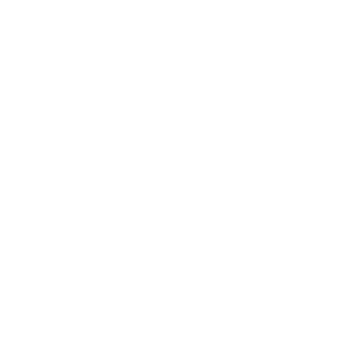
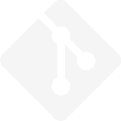
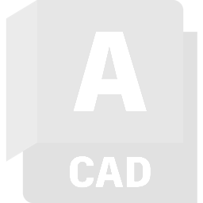

Hi!

I'm a Computer Enginnering Student who seeks to learn more about Full-Stack with 
Python, HTML, CSS, JavaScipt and other usefull tools. 👨🏻‍💻

I have interest in robotics too, and cool projects with circuit boards. 
You can see some of my experience in these areas on my Linkedin page(pinned in this profile)! 

Here are some of the tools I use most in my personal projects and studies 🔧:
Python - HTML5 - CSS3 - JavaScript - MySQL - Git - GitHub - Linux - AutoCAD

  
  
  
  
  
  
  
  

Contacts:

<nav id="navigation">
  
  
</nav>